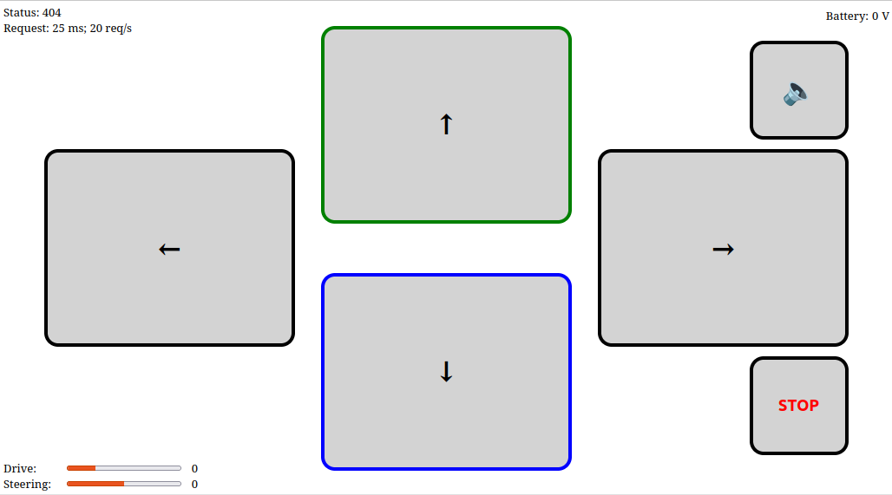

# RC-Car (Wi‑Fi AP Controller)

Simple RcCar created from Raspberry Pi Zero 2W. After power up it creates a Wi‑Fi Access Point (AP). After connecting to it you have the controller available at `http://192.168.4.1`.

## How it works

- The device starts in AP mode with SSID/password defined in `main.py`.
- A small HTTP server serves the controller UI (from `index.html`).
- The web UI sends control updates (steering/drive/horn) via HTTP requests.

## Files

- `main.py` — main firmware logic (AP + HTTP server + motor/servo control).
- `index.html` — controller web UI.
- `style.css` — styling using pure css
- `control.js` — javascript logic of controller

## Usage

1. Flash MicroPython to the board.
2. Run npm run build to create build folder with minified files
2. Copy content of `build` directory to the Pico 2.
3. Power up the car.
4. On your phone/PC, connect to the Wi‑Fi AP (SSID: `RcCar`).
5. Open `http://192.168.4.1` in a browser.

## Development (UI)

- Run `npm run serve` to serve the UI locally in your browser for easier development.
- Run `npm run build` to generate a minified `build/index.html`, `build/control.js`, `build/style.css` and copy `main.py` to `build` directory too.
- Run `npm run serve:prod` to serve the UI locally in your browser from builded files.

## Notes

- If you change SSID/password or control mapping, edit `main.py`.
- The controller UI is designed for mobile and uses touch buttons.
