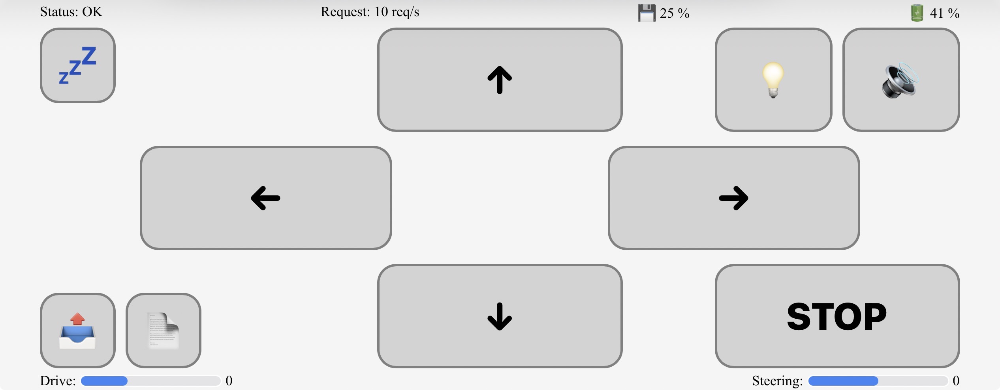

# RC-Car (Wi‑Fi AP Controller)

Simple RcCar created from Raspberry Pi Zero 2W using [Microdot](https://microdot.readthedocs.io/en/latest/) web framework. After power up it creates a Wi‑Fi Access Point (AP). After connecting to it you have the controller available at `http://192.168.4.1`.

SSID: RcCar
PASSWORD: 12345678
CountryRegion: SK
WifiChannel: 11

All above can be changed in main.py when creating AP object or you can edit default values in access_point.py.

## How it works

-   The device starts in AP mode with SSID/password defined in `access_point.py`.
-   A small HTTP server serves the controller UI (from `index.html`).
-   The web UI sends control updates (steering/drive/horn/light) via WebSocket connection.

## Files

-   `src/access_point` — creates WIFI access point 
-   `src/battery.py` — measures battery using ADC.
-   `src/main.py` — main firmware logic with defined routes for Microdot server.
-   `src/rc_car.py` — controls drive, steering, lights and honk.
-   `static/control.js` — javascript logic of controller
-   `static/index.html` — controller web UI.
-   `static/style.css` — styling using pure css

## Usage

1. Flash MicroPython to the board.
2. Run npm run build to create build folder with minified files
3. Copy content of `build` directory to the Pico 2.
4. Power up the car.
5. On your phone/PC, connect to the Wi‑Fi AP (SSID: `RcCar`).
6. Open `http://192.168.4.1` in a browser.

## Development (UI)

-   Run `npm run serve` to serve the UI locally in your browser for easier development.

## Build

-   Run `npm run build` to generate a minified `build/index.html`, `build/control.js`, `build/style.css` and copy all `*.py` to `build` directory too.
-   Run `npm run build:ota` calls npm run build and than creates ota.tar.gz archive.

## Notes

-   If you change SSID/password or control mapping, edit `main.py` or `access_point.py`.
-   The controller UI is designed for mobile and uses touch buttons.
